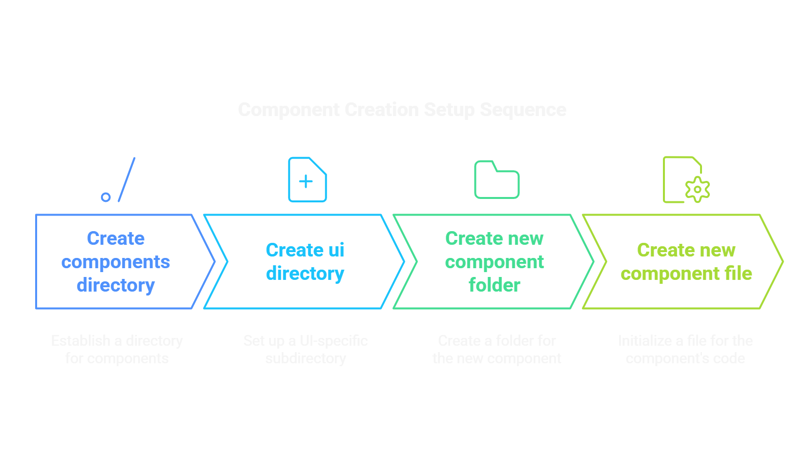
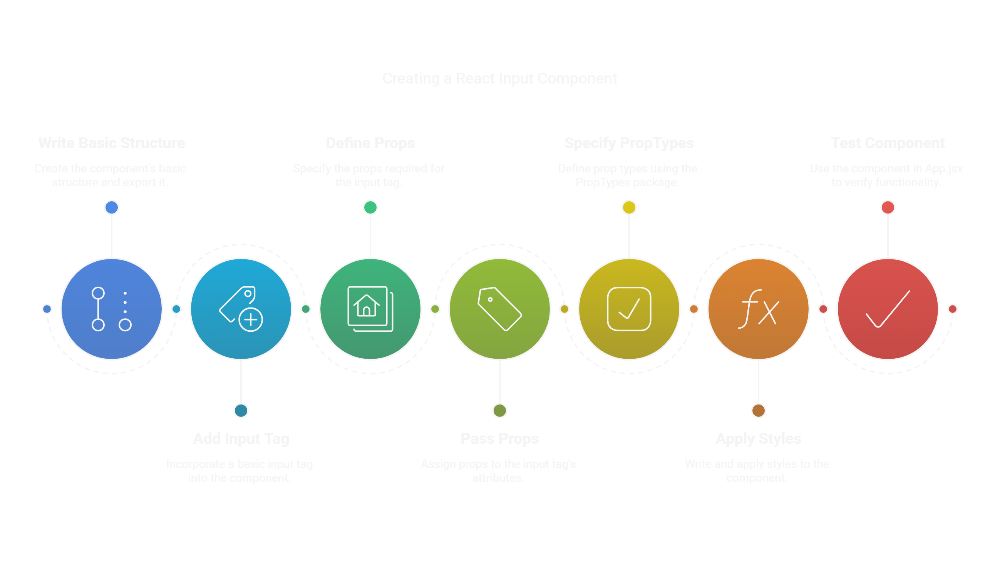

## Component Creation Setup Steps

1. Create a `components` directory in the `src` directory.  
2. Create a `ui` directory in the `components` directory.  
3. Create a new folder in the `ui` directory with the name of the new component.  
4. Create a new file in the new folder with the name of the new component.

# Component Creation Steps

### Component Name: `Input`

1. Write the basic arrow function code structure with the name of the component and export the component.  
2. Write code with a basic `<input>` tag.  
3. Define the props required to pass to the `<input>` tag.  
4. Pass the props to the `<input>` tag attributes.  
5. Define the prop types for the props using the `PropTypes` npm package.  
6. Write the required styles and apply them to the component.  
7. Use the component in `App.jsx` or any relevant pages to check its functionality.  

